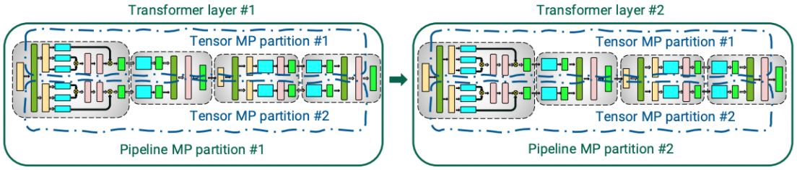

# Large-scale language modeling tutorials with PyTorch



안녕하세요. 저는 TUNiB에서 머신러닝 엔지니어로 근무 중인 고현웅입니다. 이 자료는 대규모 언어모델 개발에 필요한 여러가지 기술들을 소개드리기 위해 마련하였으며 기본적으로 PyTorch와 Transformer 언어모델에 대한 지식이 있다고 가정하고 만들었습니다. 내용 중 틀린부분이 있거나 궁금하신 부분이 있으시면 이슈나 메일로 문의 주시면 감사하겠습니다. 

- 목차의 대분류는 '세션', 소분류는 '챕터'라고 명명하였습니다.
- 모든 소스코드 및 노트북 파일은 [Github](https://github.com/tunib-ai/large-scale-lm-tutorials) 에 공개되어 있습니다. <br>
- Github에서 열람하시는 것보다 [NBViewer](https://nbviewer.org/github/tunib-ai/large-scale-lm-tutorials/tree/main/notebooks/) 로 열람하시는 것을 추천드립니다.

## Contents

1. [Introduction](https://nbviewer.org/github/tunib-ai/large-scale-lm-tutorials/blob/main/notebooks/01_introduction.ipynb)
2. [Motivation](https://nbviewer.org/github/tunib-ai/large-scale-lm-tutorials/blob/main/notebooks/02_motivation.ipynb)
3. [Distributed Programming](https://nbviewer.org/github/tunib-ai/large-scale-lm-tutorials/blob/main/notebooks/03_distributed_programming.ipynb)
4. [Overview of Parallelism](https://nbviewer.org/github/tunib-ai/large-scale-lm-tutorials/blob/main/notebooks/04_overview_of_parallelism.ipynb)
5. [Data Parallelism](https://nbviewer.org/github/tunib-ai/large-scale-lm-tutorials/blob/main/notebooks/05_data_parallelism.ipynb)
6. [Pipeline Parallelism](https://nbviewer.org/github/tunib-ai/large-scale-lm-tutorials/blob/main/notebooks/06_pipeline_parallelism.ipynb)
7. [Tensor Parallelism](https://nbviewer.org/github/tunib-ai/large-scale-lm-tutorials/blob/main/notebooks/07_tensor_parallelism.ipynb)
8. [Zero Redundancy Optimization](https://nbviewer.org/github/tunib-ai/large-scale-lm-tutorials/blob/main/notebooks/08_zero_redundancy_optimization.ipynb)
09. [Multi-dimensional Parallelism](https://nbviewer.org/github/tunib-ai/large-scale-lm-tutorials/blob/main/notebooks/09_multi_dimensional_parallelism.ipynb)
10. [Additional Techniques](https://nbviewer.org/github/tunib-ai/large-scale-lm-tutorials/blob/main/notebooks/10_additional_techiques.ipynb)

## Environments
### Local Environments
- Linux Ubuntu 18.04 LTS
- 4 * A100 GPU
- Python 3.7
- pytorch==1.9.0+cu111

### Docker Environments
- `docker pull pytorch/pytorch:1.9.0-cuda11.1-cudnn8-devel`
- 원활한 실습을 위해 `--shm-size`를 키우거나 `--ipc=host` 옵션을 설정해주세요.


## LICENSE

```
Copyright 2021 TUNiB Inc

Licensed under the Apache License, Version 2.0 (the "License");
you may not use this file except in compliance with the License.
You may obtain a copy of the License at

http://www.apache.org/licenses/LICENSE-2.0

Unless required by applicable law or agreed to in writing, software
distributed under the License is distributed on an "AS IS" BASIS,
WITHOUT WARRANTIES OR CONDITIONS OF ANY KIND, either express or implied.
See the License for the specific language governing permissions and
limitations under the License.
```